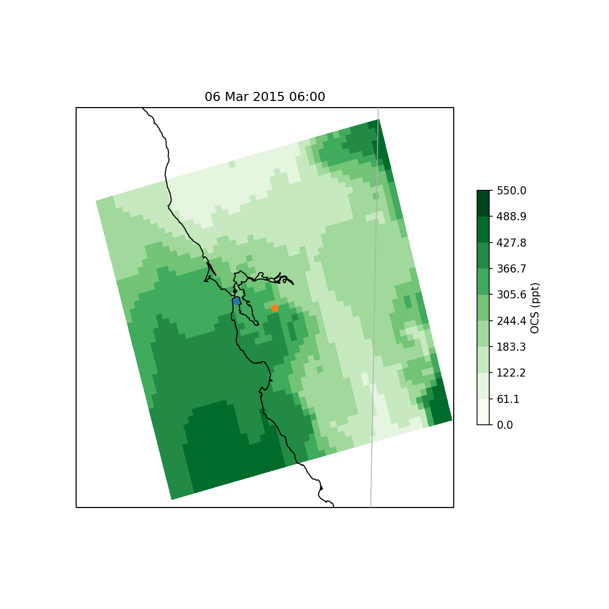

# OCSUrbanEmissions #

This repository contains code developed for the urban carbon dioxide flux experiments being run by [Gara Villalba Méndez](http://ictaweb.uab.cat/personal_detail.php?id=8) at [Universitat Autònoma de Barcelona](http://www.uab.cat).  Code developed by [Timothy W. Hilton](https://www.researchgate.net/profile/Timothy_Hilton), [University of California, Santa Cruz](https://www.ucsc.edu).

### Summary ###

Broadly, the code here performs four tasks, all of which either pre- or post-process data for/from the [Sulfur Transport and dEposition Model (STEM)](https://github.com/Timothy-W-Hilton/STEM).  STEM source code is not included here, but is [also on Github](https://github.com/Timothy-W-Hilton/STEM).  The STEM code that is edited to compile with [gfortran](https://gcc.gnu.org/fortran/) at [PIC](https://www.pic.es) is in the [branch GNU_compilers](https://github.com/Timothy-W-Hilton/STEM/tree/GNU_compilers).

The code is divided into four subdirectories: LivermorePlotting, make_GRIDDESC, Preprocessor, and SiB_Regrid.  Their contents are described below.  Each subdirectory contains a readme file with further details about its functioning.

#### STEM pre-processing tasks performed ####
1) build a [EDSS/Models-3 I/O API](https://www.cmascenter.org/ioapi/documentation/all_versions/html/index.html) GRIDDESC file for a 1-km resolution domain around Barcelona, Spain from WRF output.  See subdirectory make_GRIDDESC/.

2) build input files for STEM from WRF output.  This is known as the STEM preprocessor.  The preprocessor creates STEM input files meteo3d (3-D WRF meteorology), meteo2d (2-D WRF meteorology), wrfheight (WRF eta levels), and topo (latitude, longitude, and topography for the STEM grid).  See subdirectory Preprocessor/.

3) Interpolate global [SiB mechanistic OCS fluxes](http://dx.doi.org/10.1002/jgrg.20068) to the 1-km Barcelona STEM grid using the [EDSS/Models-3 I/O API](https://www.cmascenter.org/ioapi/documentation/all_versions/html/index.html). See subdirectory SiB_Regrid.

#### STEM post-processing tasks performed ####

1) plots STEM-simulated carbonyl sulfide (OCS) concentrations on a map for a set of STEM simulations in the San Francisco Bay Area, USA.  An example plot:
.
See subdirectory LivermorePlotting/.
